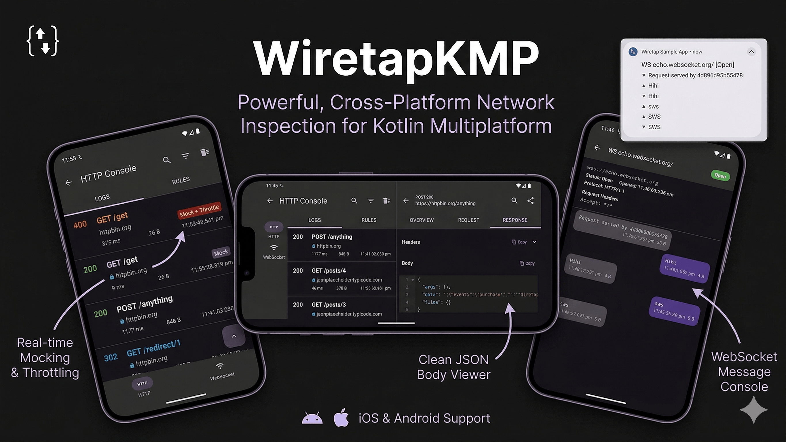
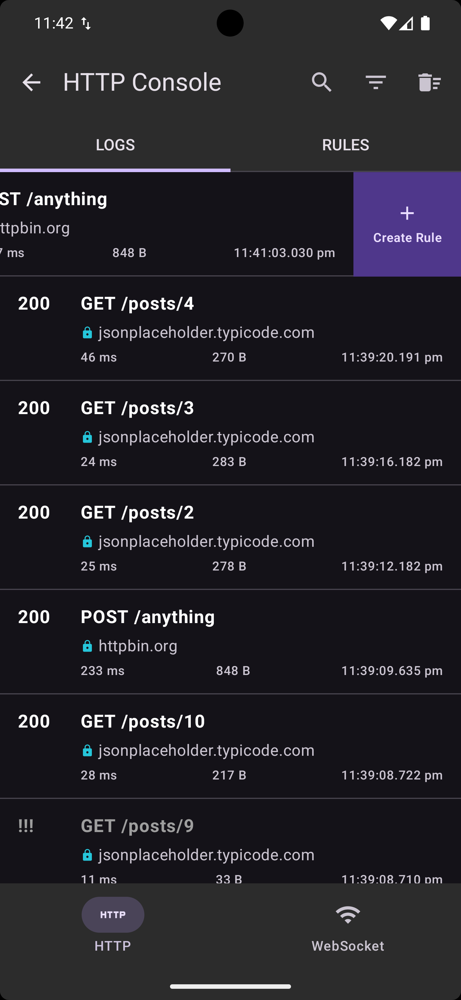
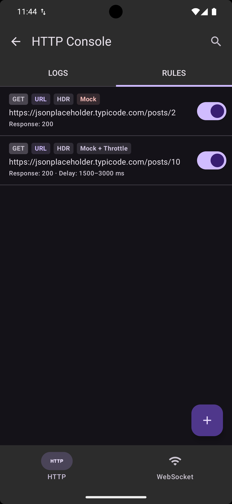
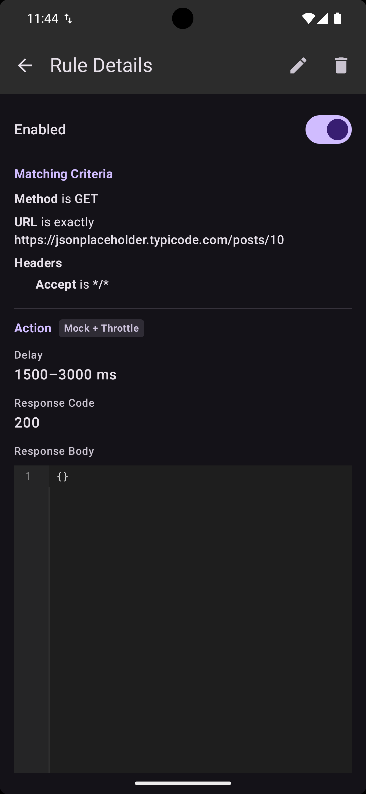
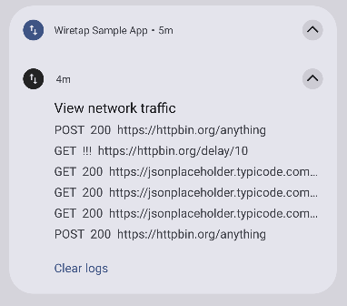
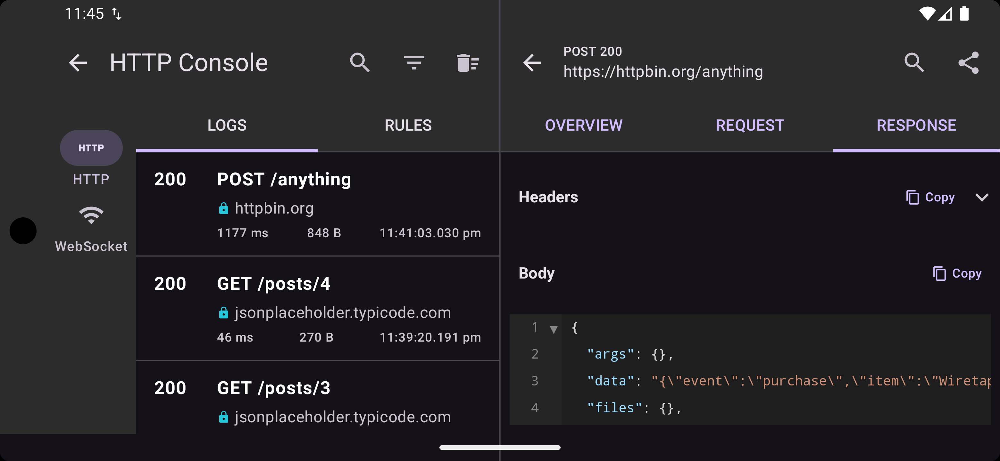

<p align="center">
  
</p>

<p align="center">
  <a href="https://github.com/skymansandy/wiretapKMP/actions/workflows/deploy.yml"></a>
  <a href="https://github.com/skymansandy/wiretapKMP/actions/workflows/deploy.yml"></a>
  <a href="https://central.sonatype.com/search?q=dev.skymansandy+wiretap"></a>
  <a href="https://androidweekly.net/issues/issue-721"></a>
</p>

WiretapKMP is a network inspection and mocking SDK for **Kotlin Multiplatform** and **Swift**. Add it to your app to capture HTTP and WebSocket traffic, mock API responses, and throttle requests — no proxy server needed. It works with **Ktor**, **OkHttp**, and **URLSession**.

## Getting Started

Pick the plugin that matches your HTTP client and add it to your project:

| Your HTTP Client | Wiretap Plugin | Platforms |
|------------------|---------------|-----------|
| **Ktor** | [`wiretap-ktor`](wiretap-ktor/README.md) | Android, iOS, JVM |
| **OkHttp** | [`wiretap-okhttp`](wiretap-okhttp/README.md) | Android, JVM |
| **URLSession** | [`wiretap-urlsession`](wiretap-urlsession/README.md) | iOS |

For full setup instructions including OkHttp and URLSession, see the [**Getting Started guide**](https://skymansandy.dev/wiretapKMP/getting-started/).

## Screenshots

### HTTP Inspector

| Overview | Request | Response |
|:--------:|:-------:|:--------:|
|  |  |  |

### WebSocket Inspector

| Connections | Messages |
|:-----------:|:--------:|
|  |  |

### API Mocking & Throttling

| Mocked Requests | Mocked Response | Mock Rule | Throttle Rule | Mock + Throttle |
|:---------------:|:---------------:|:---------:|:-------------:|:---------------:|
|  |  |  |  |  |

### Rules Engine

| Swipe to Create | Request Setup | Response Setup | Rules List | Rule Details |
|:---------------:|:-------------:|:--------------:|:----------:|:------------:|
|  |  |  |  |  |

### Notifications

| HTTP | WebSocket |
|:----:|:---------:|
|  |  |

### List-Detail Pane (Tablet / Desktop)



## Features

- **HTTP & WebSocket Logging** — capture URLs, headers, bodies, status codes, timing, and TLS details
- **API Mocking** — return fake responses without hitting the network
- **Request Throttling** — simulate slow connections with fixed or random delays
- **Header Masking** — redact sensitive headers from logs
- **Log Retention** — keep logs forever, per session, or auto-prune after N days
- **Built-in Inspector UI** — Compose Multiplatform UI for browsing logs and managing rules
- **No-op Variants** — drop-in release replacements with zero overhead

## No-op Variants

Swap dependencies for release builds — no conditional code needed:

| Debug | Release |
|-------|---------|
| `wiretap-ktor` | `wiretap-ktor-noop` |
| `wiretap-okhttp` | `wiretap-okhttp-noop` |

For URLSession, use `WiretapURLSession` in debug and plain `URLSession` in release.

## Documentation

[Full documentation](https://skymansandy.dev/wiretapKMP/) · [Getting Started](https://skymansandy.dev/wiretapKMP/getting-started/)

## Contributing

Contributions are welcome! Here's how to get started:

1. **Fork** the repository
2. **Create** a feature branch (`git checkout -b feature/my-feature`)
3. **Commit** your changes (`git commit -m 'Add my feature'`)
4. **Push** to the branch (`git push origin feature/my-feature`)
5. **Open** a Pull Request

## Acknowledgements

- [JetBrains](https://www.jetbrains.com/) — for [Kotlin Multiplatform](https://kotlinlang.org/docs/multiplatform.html), [Compose Multiplatform](https://www.jetbrains.com/compose-multiplatform/), and [Ktor](https://ktor.io/)
- [Android Jetpack](https://developer.android.com/jetpack) — for [Room](https://developer.android.com/kotlin/multiplatform/room), [App Startup](https://developer.android.com/topic/libraries/app-startup), and [Compose](https://developer.android.com/develop/ui/compose)
- [Koin](https://insert-koin.io/) — lightweight dependency injection for KMP
- [OkHttp](https://square.github.io/okhttp/) — by Square, for the HTTP client and interceptor APIs
- [SKIE](https://skie.touchlab.co/) — by Touchlab, for Swift-friendly KMP interop
- [KMMBridge](https://kmmbridge.touchlab.co/) — by Touchlab, for SPM publishing of KMP frameworks

## License

```
Copyright 2026 skymansandy

Licensed under the Apache License, Version 2.0 (the "License");
you may not use this file except in compliance with the License.
You may obtain a copy of the License at

    http://www.apache.org/licenses/LICENSE-2.0

Unless required by applicable law or agreed to in writing, software
distributed under the License is distributed on an "AS IS" BASIS,
WITHOUT WARRANTIES OR CONDITIONS OF ANY KIND, either express or implied.
See the License for the specific language governing permissions and
limitations under the License.
```
