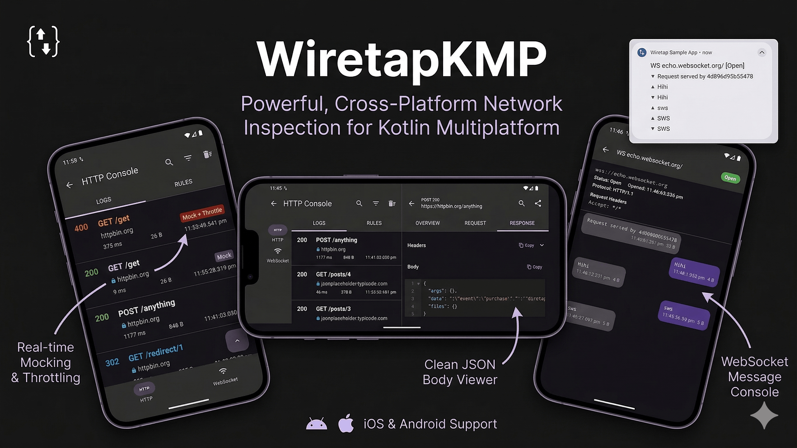
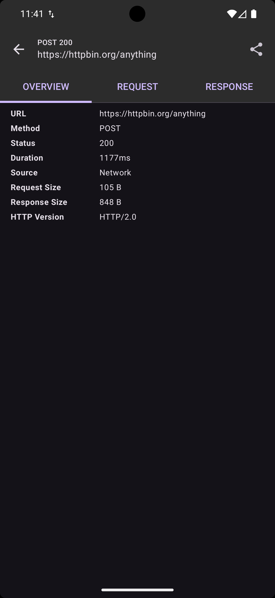
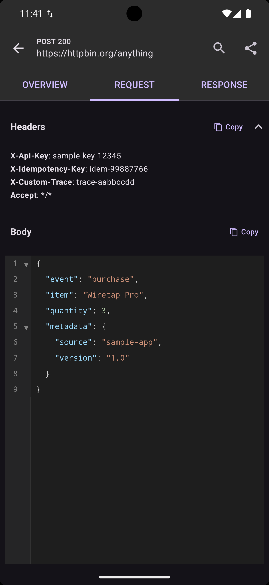
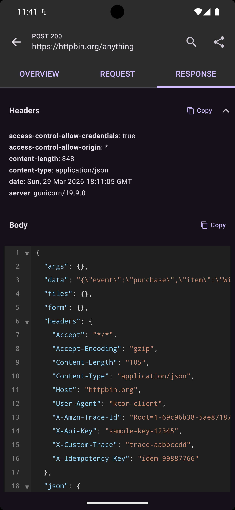
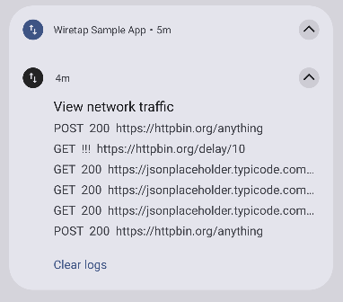
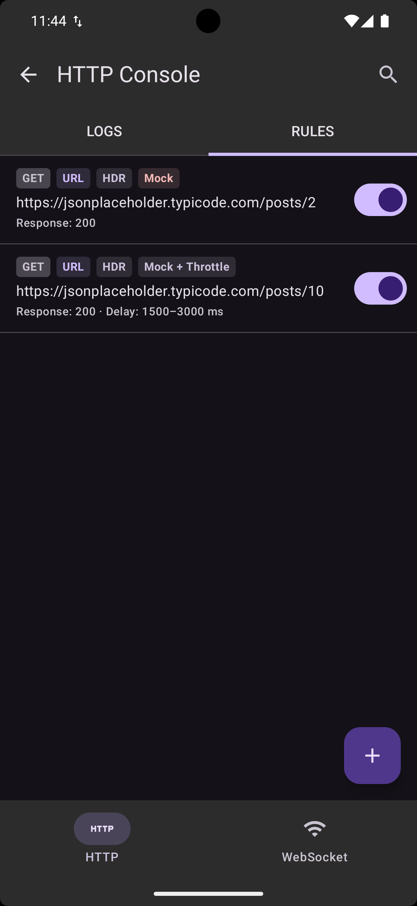
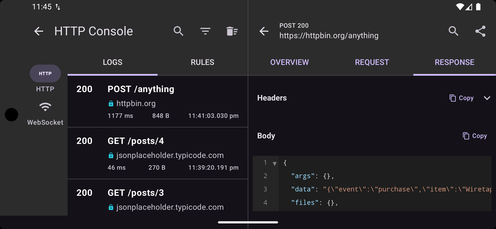

<p align="center">
  
</p>

<p align="center">
  <a href="https://github.com/skymansandy/wiretapKMP/actions/workflows/deploy.yml"></a>
  <a href="https://skymansandy.github.io/wiretapKMP/coverage/"></a>
  <a href="https://central.sonatype.com/search?q=dev.skymansandy+wiretap"></a>
</p>

**WiretapKMP** is a drop-in network inspector and mocker for **Kotlin Multiplatform** apps. Add one dependency, install the plugin, and inspect every HTTP request, WebSocket message, and SSE event — or mock and throttle them — all from a built-in UI. No proxy needed.

> **Early Preview** — We're looking for early adopters and feedback! [Open an issue](https://github.com/skymansandy/wiretapKMP/issues) or [start a discussion](https://github.com/skymansandy/wiretapKMP/discussions).

## 🚀 Quick Start

```kotlin
// Ktor
val client = HttpClient {
    install(WiretapKtorHttpPlugin)
}

// OkHttp
val client = OkHttpClient.Builder()
    .addInterceptor(WiretapOkHttpInterceptor())
    .build()
```

That's it. Open your app and shake the device (or press `Ctrl+Shift+D` on desktop) to launch the inspector.

## ✅ What You Get

| | HTTP | WebSocket | SSE |
|--|:----:|:---------:|:---:|
| **Ktor** | ✅ | ✅ | ✅ |
| **OkHttp** | ✅ | ✅ | ✅ |
| **URLSession** | ✅ | — | — |

| | Android | iOS | JVM Desktop |
|--|:-------:|:---:|:-----------:|
| **Ktor** | ✅ | ✅ | ✅ |
| **OkHttp** | ✅ | — | ✅ |
| **URLSession** | — | ✅ | — |

## 📸 Screenshots

| Overview | Request | Response |
|:--------:|:-------:|:--------:|
|  |  |  |

| WebSocket | Messages | Notifications |
|:---------:|:--------:|:-------------:|
|  |  |  |

## ⭐ Key Features

- **Zero-config logging** — install the plugin and all traffic is captured automatically
- **API mocking** — return fake responses without hitting the network. Match on method, URL, headers, and body
- **Request throttling** — simulate slow connections with fixed or random delays
- **Header masking** — redact `Authorization`, `Cookie`, or any sensitive header from logs
- **Shake to launch** — built-in gesture to open the inspector (no UI code required)
- **No-op variants** — swap to `wiretap-ktor-noop` / `wiretap-okhttp-noop` for release builds with zero overhead
- **Share as file** — export any log entry via the platform share sheet

<details>
<summary><strong>More screenshots</strong></summary>

### API Mocking & Rules Engine

| Mocked Requests | Mock Rule | Rules List |
|:---------------:|:---------:|:----------:|
|  |  |  |

### List-Detail Pane (Tablet / Desktop)



</details>

## 📡 SSE Inspection (Experimental)

WiretapKMP can inspect **Server-Sent Events (SSE)** streams — log every connection, event, and status change right alongside your HTTP and WebSocket traffic.

> ⚠️ SSE inspection is in **early preview**. APIs are marked with `@ExperimentalWiretapSseApi` and may change in future releases.

### Ktor

Install the SSE plugin — sessions are wrapped automatically:

```kotlin
@OptIn(ExperimentalWiretapSseApi::class)
val client = HttpClient {
    install(SSE)
    install(WiretapKtorSsePlugin)    // SSE logging
    install(WiretapKtorHttpPlugin)   // HTTP logging
}

client.sse("https://api.example.com/stream") {
    incoming.collect { event ->
        println("Event: ${event.event} — ${event.data}")
    }
}
```

### OkHttp

Wrap your `EventSourceListener` with `.wiretapped()`:

```kotlin
val client = OkHttpClient.Builder()
    .addInterceptor(WiretapOkHttpInterceptor())
    .build()

val request = Request.Builder().url("https://api.example.com/stream").build()
val factory = EventSources.createFactory(client)

@OptIn(ExperimentalWiretapSseApi::class)
factory.newEventSource(request, myListener.wiretapped())
```

### What Gets Logged

| Connection | Events |
|:----------:|:------:|
| URL, headers, status (Open → Closed/Failed), timestamps | Event type, data payload, event ID, byte count, timestamp |

For full details, see the [Ktor SSE guide](https://skymansandy.dev/wiretapKMP/ktor/sse/) and [OkHttp SSE guide](https://skymansandy.dev/wiretapKMP/okhttp/sse/).

## 📦 Installation

```kotlin
// build.gradle.kts
debugImplementation("dev.skymansandy:wiretap-ktor:1.0.0-RC15")
releaseImplementation("dev.skymansandy:wiretap-ktor-noop:1.0.0-RC15")

// or for OkHttp
debugImplementation("dev.skymansandy:wiretap-okhttp:1.0.0-RC15")
releaseImplementation("dev.skymansandy:wiretap-okhttp-noop:1.0.0-RC15")
```

For full setup including URLSession and advanced configuration, see the [**Getting Started guide**](https://skymansandy.dev/wiretapKMP/getting-started/).

## 📖 Documentation

[Full docs](https://skymansandy.dev/wiretapKMP/) · [Getting Started](https://skymansandy.dev/wiretapKMP/getting-started/) · [API Reference](https://skymansandy.dev/wiretapKMP/ktor/api/)

## 🤝 Contributing

Contributions are welcome! Fork the repo, create a feature branch, and open a PR.

## 🙏 Acknowledgements

[Kotlin Multiplatform](https://kotlinlang.org/docs/multiplatform.html) · [Compose Multiplatform](https://www.jetbrains.com/compose-multiplatform/) · [Ktor](https://ktor.io/) · [Room](https://developer.android.com/kotlin/multiplatform/room) · [Koin](https://insert-koin.io/) · [OkHttp](https://square.github.io/okhttp/) · [SKIE](https://skie.touchlab.co/) · [KMMBridge](https://kmmbridge.touchlab.co/)
