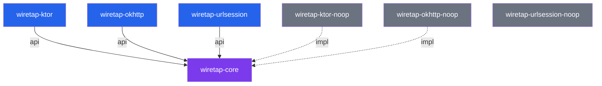

# Module Structure

WiretapKMP is organized into focused modules that can be mixed and matched based on your client library and build variant.

## Module Map

```
WiretapKMP/
├── wiretap-core/               Core SDK (all platforms)
├── wiretap-ktor/               Ktor client plugin
├── wiretap-ktor-noop/          Ktor no-op stubs (release)
├── wiretap-okhttp/             OkHttp interceptor
├── wiretap-okhttp-noop/        OkHttp no-op stubs (release)
├── wiretap-urlsession/         URLSession interceptor (iOS)
├── wiretap-urlsession-noop/    URLSession no-op stubs (iOS release)
├── composeApp/                 KMP Compose sample app
├── androidApp/                 Android sample wrapper
└── swiftSampleApp/             Native Swift sample app
```

## wiretap-core

**Platforms:** Android, iOS, JVM

The core module contains everything except client-specific plugins:

- **Config** — `WiretapConfig`, `HeaderAction`, `LogRetention`
- **Domain** — `WiretapOrchestrator`, repositories, use cases, rule matching
- **Data** — SQLDelight database, DAOs, entity models
- **DI** — Koin modules (`wiretapModule`, `wiretapDataModule`, `wiretapUtilityModule`)
- **UI** — Compose Multiplatform inspector (`WiretapScreen`, detail screens, rule management)
- **Platform** — Android activity/notifications/shake launcher, iOS launcher, JVM driver

**Dependencies exposed as `api()`:** Koin, Coroutines, SQLDelight runtime

## wiretap-ktor

**Platforms:** Android, iOS, JVM

Ktor client plugin with full interception:

- `WiretapKtorPlugin` — HTTP request/response logging + rule evaluation
- `WiretapKtorWebSocketPlugin` — WebSocket connection/message logging
- `WiretapWebSocketSession` — Session wrapper for message interception
- Rule engines: `MockEngine`, `ThrottleEngine` (Ktor-specific, not Koin-registered)

**Dependencies exposed as `api()`:** wiretap-core, ktor-client-core

**Platform engines:** ktor-client-android, ktor-client-darwin, ktor-client-java

## wiretap-ktor-noop

**Platforms:** Android, iOS, JVM

Drop-in replacement for release builds:

- Same `WiretapKtorPlugin` and `WiretapKtorWebSocketPlugin` vals with empty bodies
- Empty Koin module
- Same package (`dev.skymansandy.wiretap`) for API compatibility
- Zero overhead — no database, no logging, no rule evaluation

## wiretap-okhttp

**Platforms:** Android, JVM

OkHttp interceptor with full interception:

- `WiretapOkHttpInterceptor` — HTTP logging + rule evaluation + TLS details
- `WiretapOkHttpWebSocketListener` — WebSocket event logging
- `WiretapWebSocket` — Internal WebSocket wrapper for outgoing message logging

**Dependencies exposed as `api()`:** wiretap-core, okhttp

## wiretap-okhttp-noop

**Platforms:** Android, JVM

Drop-in replacement for release builds:

- `WiretapOkHttpInterceptor` calls `chain.proceed()` directly
- `WiretapOkHttpWebSocketListener` delegates all events without logging
- Empty Koin module

## wiretap-urlsession

**Platforms:** iOS (iosArm64 + iosSimulatorArm64)

URLSession interceptor for native iOS:

- `WiretapURLSessionInterceptor` — Two APIs: `intercept()` (full rules) and `dataTask()` (logging only)
- Published as `WiretapURLSession` static framework via KMMBridge/SPM
- Exports wiretap-core (included in framework)

## wiretap-urlsession-noop

**Platforms:** iOS (iosArm64 + iosSimulatorArm64)

Drop-in replacement for release builds:

- Same `WiretapURLSession` framework name
- `intercept()` executes request directly
- `dataTask()` returns raw session task
- No Koin, no database, no logging

## Dependency Graph



Solid arrows = `api()` dependency (transitive). Dashed arrows = `implementation()` (not transitive).
