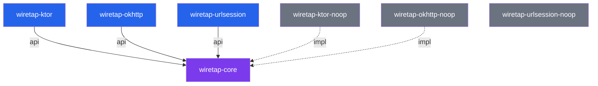

# Module Structure

## Module Map

```
WiretapKMP/
├── wiretap-core/               Core SDK (Android, iOS, JVM)
├── wiretap-ktor/               Ktor client plugin (Android, iOS, JVM)
├── wiretap-ktor-noop/          Ktor no-op stubs (release)
├── wiretap-okhttp/             OkHttp interceptor (Android, JVM)
├── wiretap-okhttp-noop/        OkHttp no-op stubs (release)
├── wiretap-urlsession/         URLSession interceptor (iOS)
├── wiretap-urlsession-noop/    URLSession no-op stubs (iOS release)
├── composeApp/                 KMP Compose sample app
├── androidApp/                 Android sample wrapper
└── swiftSampleApp/             Native Swift sample app
```

## wiretap-core

**Platforms:** Android, iOS, JVM

The core module contains everything except client-specific plugins:

| Package | Contents |
|---------|----------|
| `config` | `WiretapConfig`, `HeaderAction`, `LogRetention` |
| `domain.orchestrator` | `WiretapOrchestrator`, `HttpOrchestrator`, `SocketOrchestrator` |
| `domain.repository` | `HttpRepository`, `SocketRepository`, `RuleRepository` |
| `domain.usecase` | `FindMatchingRuleUseCase`, `FindConflictingRulesUseCase` |
| `domain.model` | `RuleAction`, `UrlMatcher`, `HeaderMatcher`, `BodyMatcher`, `ResponseSource`, enums |
| `data.db.entity` | `HttpLogEntry`, `SocketLogEntry`, `SocketMessage`, `WiretapRule` |
| `data.db.dao` | `HttpDao`, `SocketDao`, `RuleDao` (internal) |
| `data.repository` | `HttpRepositoryImpl`, `SocketRepositoryImpl`, `RuleRepositoryImpl` (internal) |
| `di` | `wiretapModule`, `WiretapDi`, `WiretapKoinContext` |
| `helper.logger` | `WiretapLogger`, `WiretapLoggerImpl` |
| `ui` | `WiretapScreen`, `HttpLogDetailScreen`, `SocketDetailScreen`, rule screens |

**Dependencies exposed as `api()`:** Koin, Coroutines, SQLDelight runtime

## wiretap-ktor

**Platforms:** Android, iOS, JVM

| Component | Description |
|-----------|-------------|
| `WiretapKtorPlugin` | HTTP request/response logging + rule evaluation |
| `WiretapKtorWebSocketPlugin` | WebSocket connection/message logging |
| `WiretapWebSocketSession` | Session wrapper for message interception |

**Dependencies exposed as `api()`:** wiretap-core, ktor-client-core

**Platform engines:** ktor-client-android, ktor-client-darwin, ktor-client-java

## wiretap-ktor-noop

Same API surface with empty implementations. Same package (`dev.skymansandy.wiretap`) for drop-in replacement.

## wiretap-okhttp

**Platforms:** Android, JVM

| Component | Description |
|-----------|-------------|
| `WiretapOkHttpInterceptor` | HTTP logging + rule evaluation + TLS details |
| `WiretapOkHttpWebSocketListener` | WebSocket event logging |
| `WiretapWebSocket` | Internal outgoing message logger |

**Dependencies exposed as `api()`:** wiretap-core, okhttp

## wiretap-okhttp-noop

Same API surface with pass-through implementations.

## wiretap-urlsession

**Platforms:** iOS (iosArm64 + iosSimulatorArm64)

| Component | Description |
|-----------|-------------|
| `WiretapURLSessionInterceptor` | Two APIs: `intercept()` (full rules) and `dataTask()` (logging only) |

Published as `WiretapURLSession` static framework via KMMBridge/SPM. Exports wiretap-core.

## wiretap-urlsession-noop

Same `WiretapURLSession` framework name. Pass-through behavior, no Koin, no database, no logging.

## Dependency Graph



Solid arrows = `api()` dependency (transitive). Dashed arrows = `implementation()` (not transitive).
