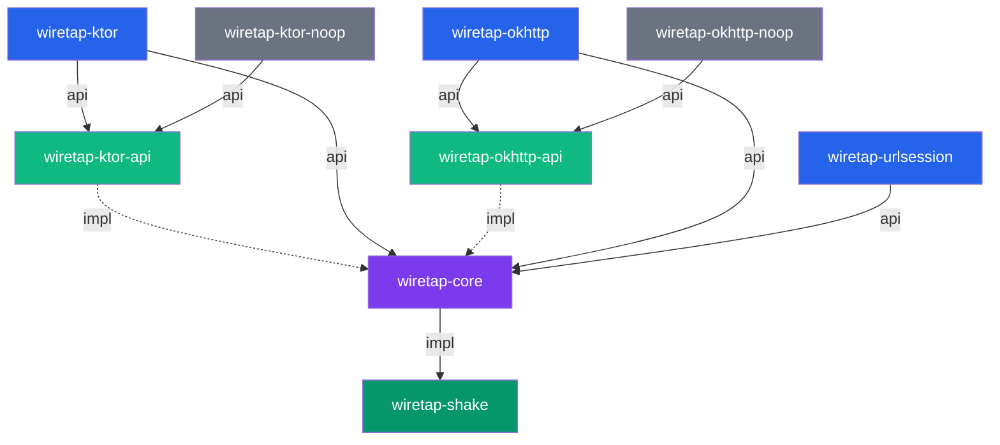

# Module Structure

## Module Map

```
WiretapKMP/
├── wiretap-core/               Core SDK (Android, iOS, JVM)
├── wiretap-ktor-api/           Ktor API surface — no-op by default (Android, iOS, JVM)
├── wiretap-ktor/               Ktor client plugin (Android, iOS, JVM)
├── wiretap-ktor-noop/          Ktor no-op — re-exports wiretap-ktor-api (release)
├── wiretap-okhttp-api/         OkHttp API surface — no-op by default (Android, JVM)
├── wiretap-okhttp/             OkHttp interceptor (Android, JVM)
├── wiretap-okhttp-noop/        OkHttp no-op — re-exports wiretap-okhttp-api (release)
├── wiretap-urlsession/         URLSession interceptor (iOS)
├── wiretap-shake/              Shake detector (iOS, via swiftklib)
├── composeApp/                 KMP Compose sample app
├── androidApp/                 Android sample wrapper
└── swiftSampleApp/             Native Swift sample app
```

## wiretap-core

**Platforms:** Android, iOS, JVM

The core module contains everything except client-specific plugins:

| Package | Contents |
|---------|----------|
| `config` | `WiretapConfig`, `HeaderAction`, `LogRetention` |
| `domain.orchestrator` | `WiretapOrchestrator`, `HttpOrchestrator`, `SocketOrchestrator` |
| `domain.repository` | `HttpRepository`, `SocketRepository`, `RuleRepository` |
| `domain.usecase` | `FindMatchingRuleUseCase`, `FindConflictingRulesUseCase` |
| `domain.model` | `RuleAction`, `UrlMatcher`, `HeaderMatcher`, `BodyMatcher`, `ResponseSource`, enums |
| `data.db.entity` | `HttpLogEntry`, `SocketEntry`, `SocketMessage`, `WiretapRule` |
| `data.db.dao` | `HttpDao`, `SocketDao`, `RuleDao` (internal) |
| `data.repository` | `HttpRepositoryImpl`, `SocketRepositoryImpl`, `RuleRepositoryImpl` (internal) |
| `di` | `wiretapModule`, `WiretapDi`, `WiretapKoinContext` |
| `helper.logger` | `WiretapLogger`, `WiretapLoggerImpl` |
| `ui` | `WiretapScreen`, `HttpLogDetailScreen`, `SocketDetailScreen`, rule screens |

**Dependencies exposed as `api()`:** Koin, Coroutines, SQLDelight runtime

## wiretap-ktor-api

**Platforms:** Android, iOS, JVM

Lightweight API surface for multi-module apps. Defines public types that are no-op by default and delegate to real implementations when `wiretap-ktor` is on the classpath.

| Component | Description |
|-----------|-------------|
| `WiretapKtorHttpPlugin` | Plugin val — delegates to `WiretapKtorHttpPluginDelegate` via Koin |
| `WiretapKtorWebSocketPlugin` | Plugin val — delegates to `WiretapKtorWsPluginDelegate` via Koin |
| `WiretapWebSocketSession` | Session interface + `DelegatingWebSocketSession` passthrough |
| `wiretapped()` | Extension — delegates to `WiretapWebSocketSessionFactory` via Koin |

**Dependencies:** wiretap-core (impl), ktor-client-core (impl)

## wiretap-ktor

**Platforms:** Android, iOS, JVM

| Component | Description |
|-----------|-------------|
| `RealKtorHttpPlugin` | HTTP request/response logging + rule evaluation |
| `RealKtorWsPlugin` | WebSocket connection logging |
| `LoggingWebSocketSession` | Session wrapper for message interception |
| `WiretapKtorModule` | Koin module registering all delegates |
| `WiretapKtorInitializer` | Android App Startup auto-registration |

**Dependencies exposed as `api()`:** wiretap-ktor-api, wiretap-core, ktor-client-core

**Platform engines:** ktor-client-android, ktor-client-darwin, ktor-client-java

## wiretap-ktor-noop

Re-exports `wiretap-ktor-api` — no source code. All types are available but no-op since no delegates are registered.

## wiretap-okhttp-api

**Platforms:** Android, JVM

Lightweight API surface for multi-module apps. Same delegation pattern as wiretap-ktor-api.

| Component | Description |
|-----------|-------------|
| `WiretapOkHttpInterceptor` | Interceptor class — delegates to `WiretapOkHttpInterceptorDelegate` via Koin |
| `WiretapOkHttpWebSocketListener` | Listener class — delegates to `WiretapOkHttpWsListenerFactory` via Koin |
| `wiretapped()` | Extension on `WebSocketListener` |

**Dependencies:** wiretap-core (impl), okhttp (impl)

## wiretap-okhttp

**Platforms:** Android, JVM

| Component | Description |
|-----------|-------------|
| `RealOkHttpInterceptor` | HTTP logging + rule evaluation + TLS details |
| `RealOkHttpWebSocketListener` | WebSocket event logging |
| `WiretapWebSocket` | Internal outgoing message logger |
| `WiretapOkHttpModule` | Koin module registering all delegates |
| `WiretapOkHttpInitializer` | Android App Startup auto-registration |

**Dependencies exposed as `api()`:** wiretap-okhttp-api, wiretap-core, okhttp

## wiretap-okhttp-noop

Re-exports `wiretap-okhttp-api` — no source code.

## wiretap-urlsession

**Platforms:** iOS (iosArm64 + iosSimulatorArm64)

| Component | Description |
|-----------|-------------|
| `WiretapURLSessionInterceptor` | Two APIs: `intercept()` (full rules) and `dataTask()` (logging only) |

Published as `WiretapURLSession` static framework via KMMBridge/SPM. Exports wiretap-core.

## wiretap-shake

**Platforms:** iOS (iosArm64 + iosSimulatorArm64)

| Component | Description |
|-----------|-------------|
| `ShakeDetector` | Kotlin object that bridges to Swift `WiretapShakeDetector` via c-interop |
| `WiretapShakeDetector.swift` | Extends `UIWindow.motionEnded` to detect shake gestures |

Used internally by `wiretap-core` on iOS to implement `enableWiretapLauncher()`. Built via the **swiftklib** plugin which compiles the Swift source and generates c-interop bindings.

!!! note
    On Android, shake detection uses the accelerometer sensor directly in `wiretap-core` — no separate module needed. On JVM Desktop, `enableWiretapLauncher()` registers a `Ctrl+Shift+D` keyboard shortcut instead.

## Dependency Graph


```mermaid
graph TD
    core["wiretap-core"]
    ktor_api["wiretap-ktor-api"]
    ktor["wiretap-ktor"]
    okhttp_api["wiretap-okhttp-api"]
    okhttp["wiretap-okhttp"]
    urlsession["wiretap-urlsession"]
    ktor_noop["wiretap-ktor-noop"]
    okhttp_noop["wiretap-okhttp-noop"]
    shake["wiretap-shake"]

    ktor_api -.->|impl| core
    ktor -->|api| ktor_api
    ktor -->|api| core
    okhttp_api -.->|impl| core
    okhttp -->|api| okhttp_api
    okhttp -->|api| core
    urlsession -->|api| core
    core -->|impl| shake
    ktor_noop -->|api| ktor_api
    okhttp_noop -->|api| okhttp_api

    style core fill:#7c3aed,color:#fff
    style ktor_api fill:#10b981,color:#fff
    style ktor fill:#2563eb,color:#fff
    style okhttp_api fill:#10b981,color:#fff
    style okhttp fill:#2563eb,color:#fff
    style urlsession fill:#2563eb,color:#fff
    style ktor_noop fill:#6b7280,color:#fff
    style okhttp_noop fill:#6b7280,color:#fff
    style shake fill:#059669,color:#fff
```

Solid arrows = `api()` dependency (transitive). Dashed arrows = `implementation()` (not transitive).
