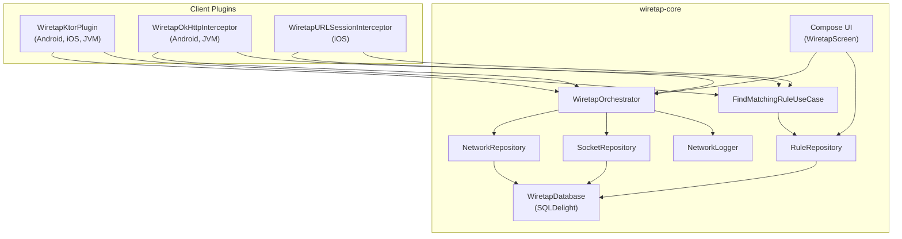

# Architecture Overview

WiretapKMP follows a layered architecture where platform-specific client plugins feed into a shared core that handles storage, rule evaluation, and UI.

## High-Level Diagram



## Data Flow

### Request Interception

1. **Plugin intercepts request** — extracts URL, method, headers, body
2. **Rule evaluation** — `FindMatchingRuleUseCase` checks for matching mock/throttle rules
3. **Request logged** — `Orchestrator.logRequest()` writes the initial entry (in-progress)
4. **Rule applied** (if any):
    - **Mock**: Plugin creates fake response, updates log entry, returns immediately
    - **Throttle**: Plugin delays, then proceeds to network
5. **Response captured** — `Orchestrator.updateEntry()` completes the log entry
6. **Logger notified** — Console output via `NetworkLogger`

### Orchestrator Pattern

The `WiretapOrchestrator` combines two sub-orchestrators via delegation:

```kotlin
class WiretapOrchestratorImpl(
    httpOrchestrator: HttpOrchestrator,
    socketOrchestrator: SocketOrchestrator,
) : WiretapOrchestrator,
    HttpOrchestrator by httpOrchestrator,
    SocketOrchestrator by socketOrchestrator
```

- **`HttpOrchestrator`** — Manages HTTP log entries (CRUD + pagination)
- **`SocketOrchestrator`** — Manages WebSocket connections and messages

Each orchestrator chains: **Repository → Logger → Platform hooks** (notifications on Android).

### Dependency Injection

Wiretap uses **Koin** (non-annotation) with lazy initialization:

```
WiretapKoinContext (lazy singleton)
  └─ wiretapModule
       ├─ wiretapDataModule (DB, DAOs, Repositories)
       ├─ wiretapUtilityModule (Logger)
       ├─ WiretapOrchestrator
       ├─ FindMatchingRuleUseCase
       └─ FindConflictingRulesUseCase
```

Plugins access Koin via `KoinComponent` — dependencies are injected lazily on first use.

### Platform Abstractions

WiretapKMP uses `expect/actual` for platform-specific implementations:

| Declaration | Android | iOS | JVM |
|------------|---------|-----|-----|
| `DriverFactory()` | SQLite Android driver (via `WiretapContextProvider`) | Native SQLite driver | JVM SQLite driver |
| `currentTimeMillis()` | `System.currentTimeMillis()` | Foundation date | `System.currentTimeMillis()` |
| `startWiretap()` | Launches `WiretapConsoleActivity` | Presents Compose UI | No-op (embed manually) |
| `enableWiretapLauncher()` | Shake gesture listener | — | — |

Android context is captured automatically via **AndroidX App Startup** (`WiretapInitializer`).
