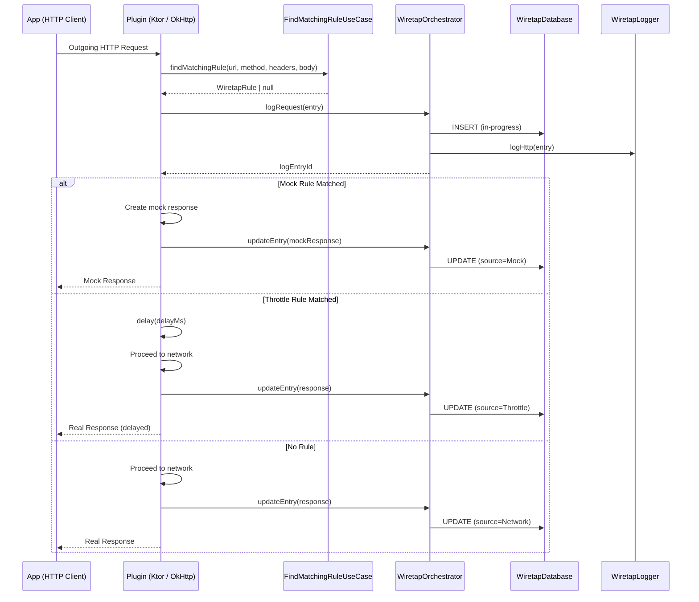
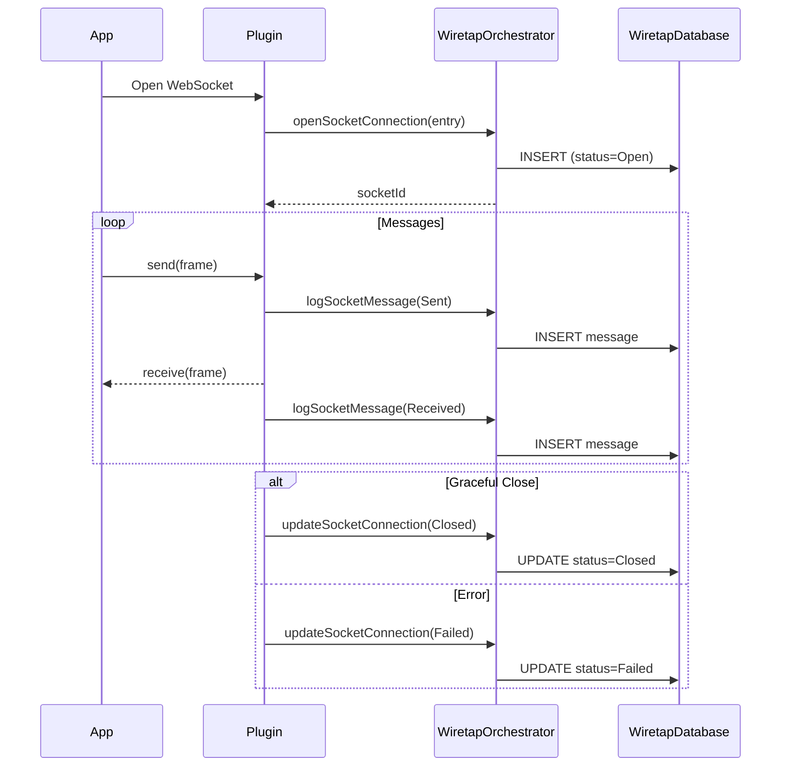

# Request Flow

## HTTP Request Lifecycle

## WebSocket Lifecycle

## Response Status Codes

| Code | Meaning |
|------|---------|
| `-2` | Request in progress (no response yet) |
| `-1` | Request cancelled |
| `0` | Network error (exception thrown) |
| `1xx–5xx` | Standard HTTP status codes |
