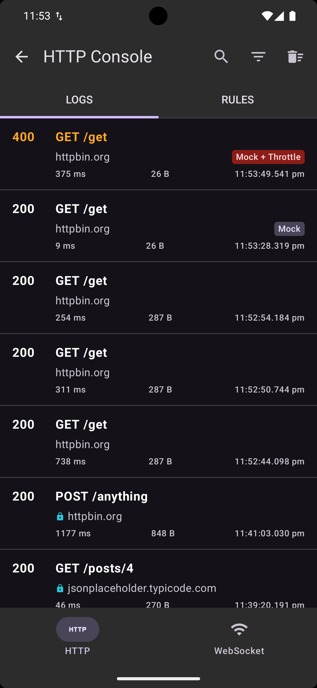
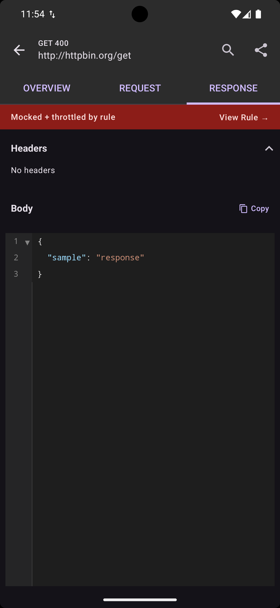
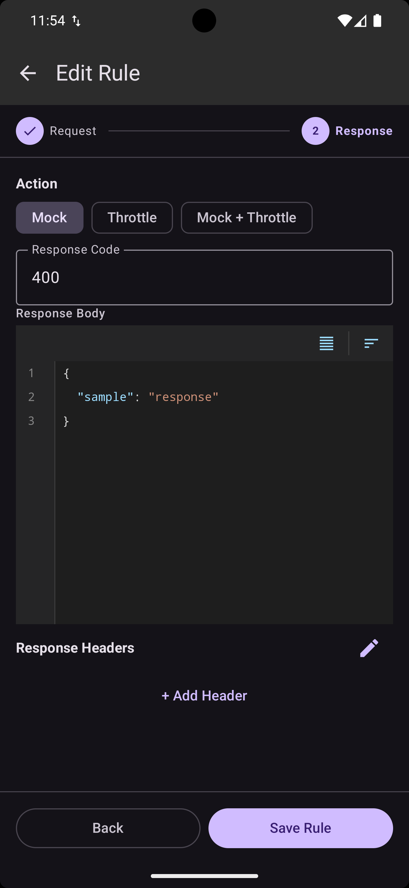
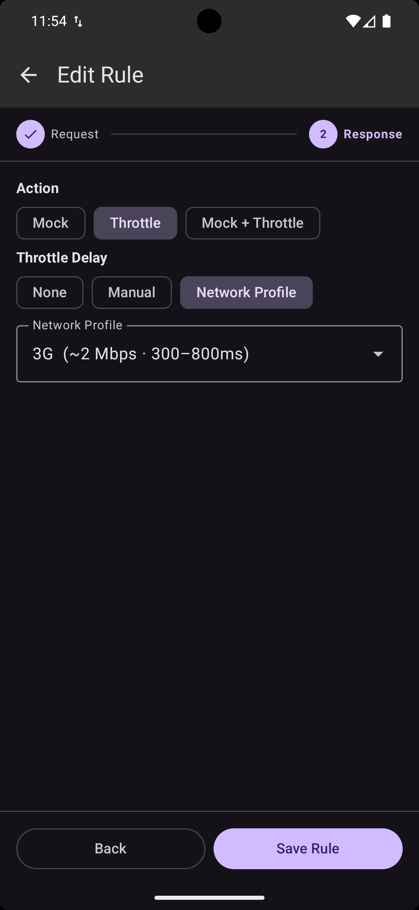
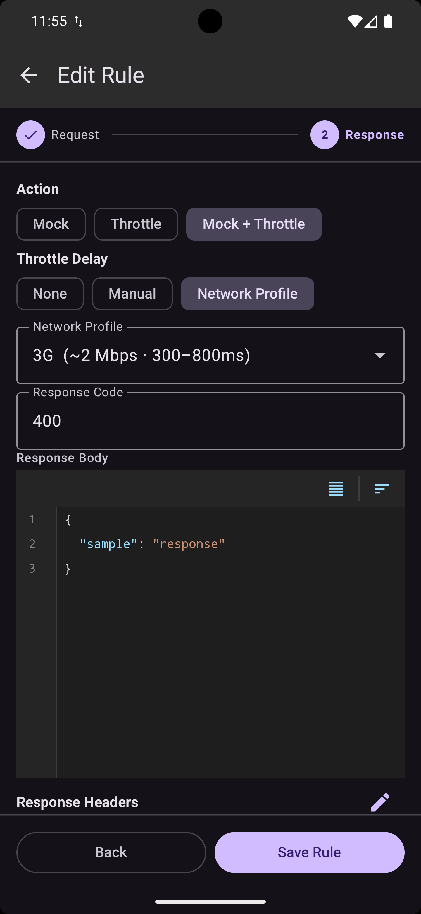
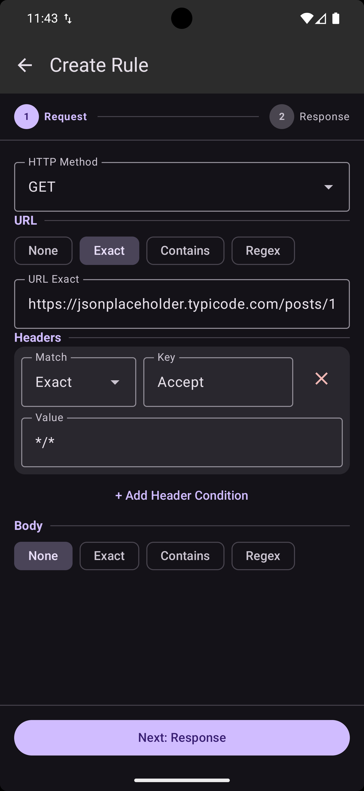
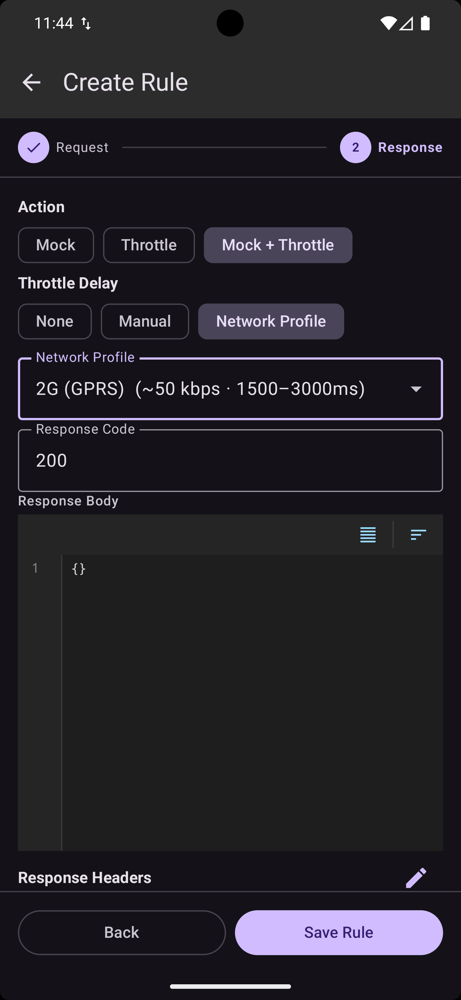

# Rules Engine

WiretapKMP includes a rules engine that can **mock responses** or **throttle requests** based on configurable matching criteria. Rules are stored in SQLite and can be managed via the built-in UI or programmatically.

## Rule Anatomy

A `WiretapRule` consists of:

- **Method** — HTTP method to match, or `"*"` for all methods
- **URL Matcher** — Pattern to match against the request URL
- **Header Matchers** — Conditions on request headers (all must match)
- **Body Matcher** — Pattern to match against the request body
- **Action** — What to do when the rule matches (Mock or Throttle)
- **Enabled** — Toggle without deleting

All criteria use **AND logic** — method AND URL AND headers AND body must all match. The first enabled matching rule wins.

## URL Matching

```kotlin
UrlMatcher.Exact("https://api.example.com/users")    // Case-insensitive exact
UrlMatcher.Contains("/api/users")                      // Substring match
UrlMatcher.Regex("https://api\\.example\\.com/users/\\d+")  // Regex
```

## Header Matching

```kotlin
HeaderMatcher.KeyExists("Authorization")               // Header exists (any value)
HeaderMatcher.ValueExact("Content-Type", "application/json")  // Exact value
HeaderMatcher.ValueContains("Accept", "json")          // Value contains substring
HeaderMatcher.ValueRegex("User-Agent", ".*Android.*")  // Value matches regex
```

Multiple header matchers use AND logic — all must match.

## Body Matching

```kotlin
BodyMatcher.Exact("""{"action": "delete"}""")
BodyMatcher.Contains("delete")
BodyMatcher.Regex(""""action":\s*"delete"""")
```

## Mock Rules

Return a fake response without hitting the network. Mock responses bypass the network entirely and appear in the inspector with a **Mock** badge. Supports custom response codes for error simulation (400, 404, 500, etc.).

=== "Mocked Requests"

    { width="300" }

=== "Mocked Response"

    { width="300" }

=== "Mock Rule Setup"

    { width="300" }

## Throttle Rules

Delay requests before they reach the network. Supports fixed delay, manual range, or network profile presets (2G, 3G, etc.).

!!! note
    Throttle rules still make the real network call — they just add delay.

=== "Throttle Rule Setup"

    { width="300" }

=== "Mock + Throttle"

    { width="300" }

## Managing Rules Programmatically

```kotlin
val ruleRepository = WiretapDi.ruleRepository

ruleRepository.addRule(rule)                        // Add
ruleRepository.getAll()                             // Flow<List<WiretapRule>>
ruleRepository.setEnabled(ruleId, enabled = false)  // Toggle
ruleRepository.deleteById(ruleId)                   // Delete
ruleRepository.deleteAll()                          // Clear all
```

## Built-in UI

The Wiretap inspector includes a **Rules** tab where you can create, edit, enable/disable, and delete rules with a multi-step form — including conflict detection for overlapping rules.

=== "Swipe to Create"

    { width="300" }

=== "Request Setup"

    { width="300" }

=== "Response Setup"

    { width="300" }

=== "Rules List"

    { width="300" }

=== "Rule Details"

    { width="300" }
