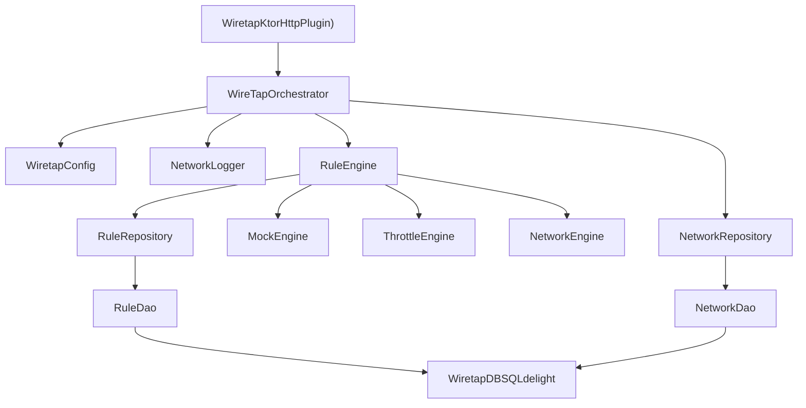

```mermaid
flowchart TD
    WiretapPlugin["WiretapKtorHttpPlugin)"]
    WireTapOrchestrator["WireTapOrchestrator"]
    WiretapConfig["WiretapConfig"]
    NetworkRepository["NetworkRepository"]
    NetworkLogger["NetworkLogger"]
    NetworkDao["NetworkDao"]
    WiretapDB["WiretapDBSQLdelight"]
    RuleEngine["RuleEngine"]
    MockEngine["MockEngine"]
    ThrottleEngine["ThrottleEngine"]
    NetworkEngine["NetworkEngine"]
    RuleRepository["RuleRepository"]
    RuleDao["RuleDao"]

    WiretapPlugin --> WireTapOrchestrator

    WireTapOrchestrator --> WiretapConfig
    WireTapOrchestrator --> NetworkRepository
    WireTapOrchestrator --> NetworkLogger
    WireTapOrchestrator --> RuleEngine

    RuleEngine --> MockEngine
    RuleEngine --> ThrottleEngine
    RuleEngine --> NetworkEngine
    RuleEngine --> RuleRepository

    RuleRepository --> RuleDao
    RuleDao --> WiretapDB

    NetworkRepository --> NetworkDao
    NetworkDao --> WiretapDB
```