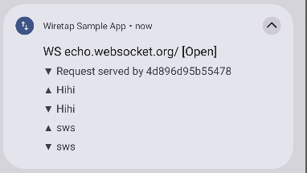

# WiretapKMP

Kotlin Multiplatform network inspection and mocking SDK. Intercepts HTTP and WebSocket traffic from Ktor, OkHttp, and URLSession clients. Logs to local SQLite. Built-in Compose UI for inspection. Mock and throttle rules engine. No proxy server needed.

## KMP Plugins

| Client | Android | iOS | JVM Desktop |
|--------|:-------:|:---:|:-----------:|
| **Ktor** | ✅ | ✅ | ✅ |
| **OkHttp** | ✅ | — | ✅ |

## Swift Wrapper

| Client | iOS |
|--------|:---:|
| **URLSession** | ✅ |

`wiretap-urlsession` is a dedicated Swift wrapper exported as an XCFramework via KMMBridge/SPM. It wraps `NSURLSession` with logging and rule support for native iOS projects.

## Screenshots

### HTTP Inspector

=== "Overview"

    { width="300" }

=== "Request"

    { width="300" }

=== "Response"

    { width="300" }

### WebSocket Inspector

=== "Connections"

    { width="300" }

=== "Messages"

    { width="300" }

### Rules Engine

=== "Swipe to Create"

    { width="300" }

=== "Request Setup"

    { width="300" }

=== "Response Setup"

    { width="300" }

=== "Rules List"

    { width="300" }

=== "Rule Details"

    { width="300" }

### Notifications

=== "HTTP"

    { width="350" }

=== "WebSocket"

    { width="350" }

### List-Detail Pane (Tablet / Desktop)

{ width="600" }

## HTTP Logging

Every request and response is captured automatically when the plugin is installed. Logged data includes:

- URL, method, request/response headers, request/response bodies
- Response status code and duration (nanosecond precision)
- Protocol version and remote address
- TLS details (OkHttp only): TLS version, cipher suite, certificate CN, issuer CN, certificate expiry

Requests appear in the inspector immediately as "in-progress" and update when the response arrives.

## WebSocket Logging

Full WebSocket lifecycle tracking:

- Connection open/close/failure with status transitions
- Close codes and reasons
- Every sent and received message (text and binary) with timestamps and byte counts
- Ktor: wrap session with `wiretapped()` for automatic message interception
- OkHttp: wrap listener with `WiretapOkHttpWebSocketListener` for automatic event capture

## API Mocking

Return fake responses without hitting the network. Rules match on method, URL, headers, and body using exact, contains, or regex matching. All criteria use AND logic.

```kotlin
WiretapRule(
    method = "GET",
    urlMatcher = UrlMatcher.Contains("/api/users"),
    action = RuleAction.Mock(
        responseCode = 200,
        responseBody = """{"users": []}""",
        responseHeaders = mapOf("Content-Type" to "application/json"),
        throttleDelayMs = 500,  // optional: simulate latency on mock
    ),
)
```

Mock responses bypass the network entirely. They appear in the inspector with a **Mock** badge.

## Request Throttling

Add artificial delay before the request reaches the network. Supports fixed delay or random delay within a range.

```kotlin
WiretapRule(
    urlMatcher = UrlMatcher.Contains("/api/"),
    action = RuleAction.Throttle(
        delayMs = 2000,
        delayMaxMs = 5000,  // random between 2–5 seconds
    ),
)
```

The real network call still happens — throttling only adds delay. Responses appear with a **Throttle** badge.

## Header Masking

Control how headers are stored in the log database. Original request/response headers are never mutated.

- **`HeaderAction.Keep`** — Log as-is (default)
- **`HeaderAction.Mask("***")`** — Replace value with mask string
- **`HeaderAction.Skip`** — Omit from logs entirely

## Log Retention

- **`LogRetention.Forever`** — Keep all logs indefinitely (default)
- **`LogRetention.AppSession`** — Clear all logs on first request after app start
- **`LogRetention.Days(n)`** — Auto-prune entries older than N days on each capture. Uses indexed timestamp queries.

## Request Filtering

`shouldLog` controls which requests are stored in the database. Requests that don't pass the filter are still subject to mock/throttle rules — they just won't appear in the inspector.

```kotlin
shouldLog = { url, method -> url.contains("/api/") }
```

## Built-in Inspector UI

Compose Multiplatform UI with:

- HTTP log list with search and filtering
- Request/response detail view (Overview, Request, Response tabs)
- WebSocket connections list and message stream view
- Rule management (create, edit, enable/disable, delete) with conflict detection
- Two-pane layout on wide screens
- Copy buttons for headers and bodies

## Shake to Launch

Wiretap includes a built-in shake detector that opens the inspector UI when the device is shaken. Call `enableWiretapLauncher()` once during app startup.

| Platform | Trigger |
|----------|---------|
| **Android** | Shake gesture (accelerometer sensor) |
| **iOS** | Shake gesture (`UIWindow.motionEnded` via `wiretap-shake` module) |
| **JVM Desktop** | `Ctrl+Shift+D` keyboard shortcut |

```kotlin
// Call once at app startup (e.g., Application.onCreate or main())
enableWiretapLauncher()
```

No additional setup is needed — the launcher registers itself and presents the Wiretap inspector automatically on trigger.

## No-op Variants

Every plugin module has a matching no-op module with identical API surface and zero runtime overhead. Swap the dependency for release builds — no conditional code needed.

| Debug | Release |
|-------|---------|
| `wiretap-ktor` | `wiretap-ktor-noop` |
| `wiretap-okhttp` | `wiretap-okhttp-noop` |

For URLSession, use `config.enabled = false` with `#if DEBUG` instead of a separate no-op module.
