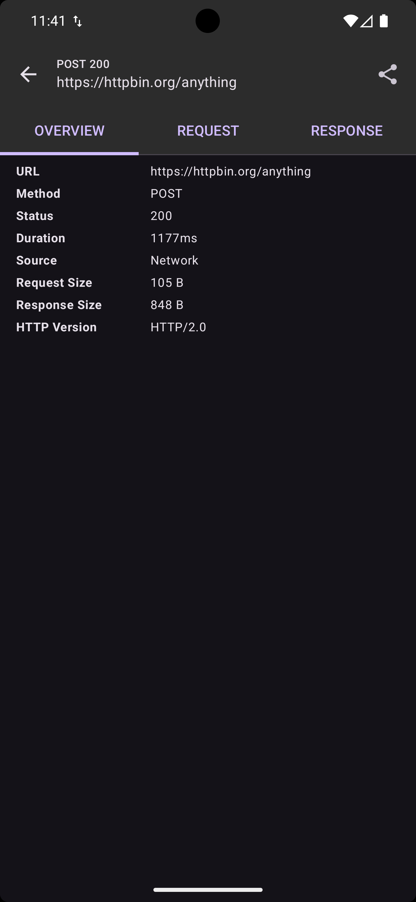
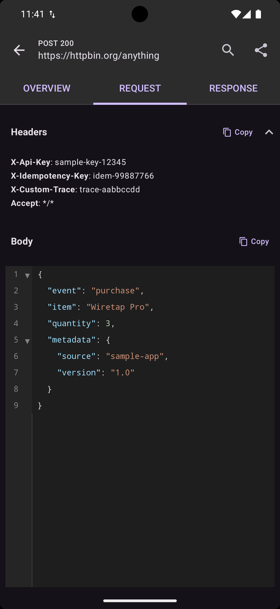
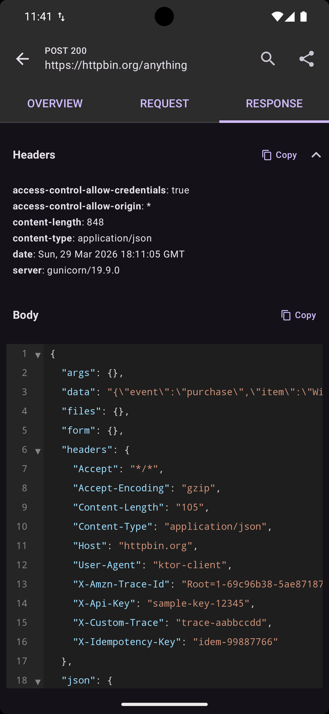

# Ktor — HTTP Logging

=== "Overview"

    { width="300" }

=== "Request"

    { width="300" }

=== "Response"

    { width="300" }

## How It Works

`WiretapKtorHttpPlugin` hooks into three Ktor lifecycle points:

1. **`onRequest`** — Captures timestamps (ms + ns) for duration measurement
2. **`on(Send)`** — Intercepts the request before it reaches the network:
    - Evaluates mock/throttle rules via `FindMatchingRuleUseCase`
    - Logs the request immediately (visible in the UI while in-flight)
    - If a **Mock** rule matches, returns a fake `HttpClientCall` without network access
    - If a **Throttle** rule matches, delays with `kotlinx.coroutines.delay()` before proceeding
3. **`onResponse`** — Updates the log entry with response data (status, headers, body, duration, protocol)

## Request Filtering

Use `shouldLog` to control which requests are captured:

```kotlin
install(WiretapKtorHttpPlugin) {
    shouldLog = { url, method ->
        url.contains("/api/") && method != "OPTIONS"
    }
}
```

Requests that don't pass `shouldLog` are still subject to rule evaluation (mock/throttle), but they won't appear in the log database.

## Header Masking

Protect sensitive data in logs:

```kotlin
install(WiretapKtorHttpPlugin) {
    headerAction = { key ->
        when {
            key.equals("Authorization", ignoreCase = true) -> HeaderAction.Mask()
            key.equals("X-Api-Key", ignoreCase = true) -> HeaderAction.Mask("REDACTED")
            key.equals("Cookie", ignoreCase = true) -> HeaderAction.Skip
            else -> HeaderAction.Keep
        }
    }
}
```

!!! info
    Header actions only affect logged data. The original request/response headers are never mutated.

## Mock Rules

When a request matches a mock rule, Wiretap creates a full `HttpClientCall` with `HttpResponseData` and returns it without hitting the network. Mock responses appear in the inspector with a **Mock** badge and near-zero duration.

=== "Mocked Requests"

    { width="300" }

=== "Mocked Response"

    { width="300" }

=== "Mock Rule Setup"

    { width="300" }

## Throttle Rules

Throttle rules call `kotlinx.coroutines.delay()` before `proceed(request)`. The real network call still happens — throttling only adds delay.

=== "Throttle Rule Setup"

    { width="300" }

=== "Mock + Throttle"

    { width="300" }

## Error Handling

Wiretap logs exceptions and re-throws them so your error handling works normally:

| Scenario | Response Code | Response Body |
|----------|:------------:|---------------|
| Network error | `0` | Exception message |
| Cancelled request | `-1` | "Canceled" |
| In-progress | `-2` | — |

## Log Retention

```kotlin
install(WiretapKtorHttpPlugin) {
    logRetention = LogRetention.Forever      // Keep all (default)
    logRetention = LogRetention.AppSession   // Clear on app restart
    logRetention = LogRetention.Days(7)      // Auto-prune after 7 days
}
```

## Complete Example

```kotlin
class ApiClient(private val client: HttpClient) {

    suspend fun getUsers(): List<User> {
        return client.get("https://api.example.com/users").body()
    }

    suspend fun createUser(name: String): User {
        return client.post("https://api.example.com/users") {
            contentType(ContentType.Application.Json)
            setBody(mapOf("name" to name))
        }.body()
    }
}
```

All requests and responses are automatically captured — no additional instrumentation needed.
