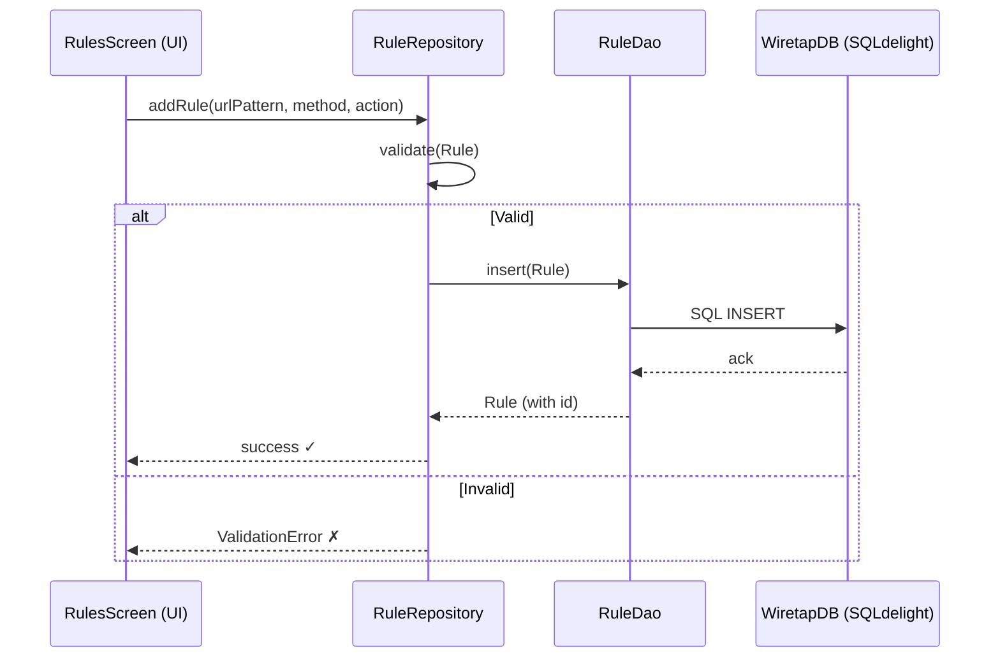

```mermaid
sequenceDiagram
    participant Screen as RulesScreen (UI)
    participant RuleRepo as RuleRepository
    participant RuleDao as RuleDao
    participant DB as WiretapDB (SQLdelight)

    Screen->>RuleRepo: addRule(urlPattern, method, action)

    RuleRepo->>RuleRepo: validate(Rule)

    alt Valid
        RuleRepo->>RuleDao: insert(Rule)
        RuleDao->>DB: SQL INSERT
        DB-->>RuleDao: ack
        RuleDao-->>RuleRepo: Rule (with id)
        RuleRepo-->>Screen: success ✓
    else Invalid
        RuleRepo-->>Screen: ValidationError ✗
    end
```