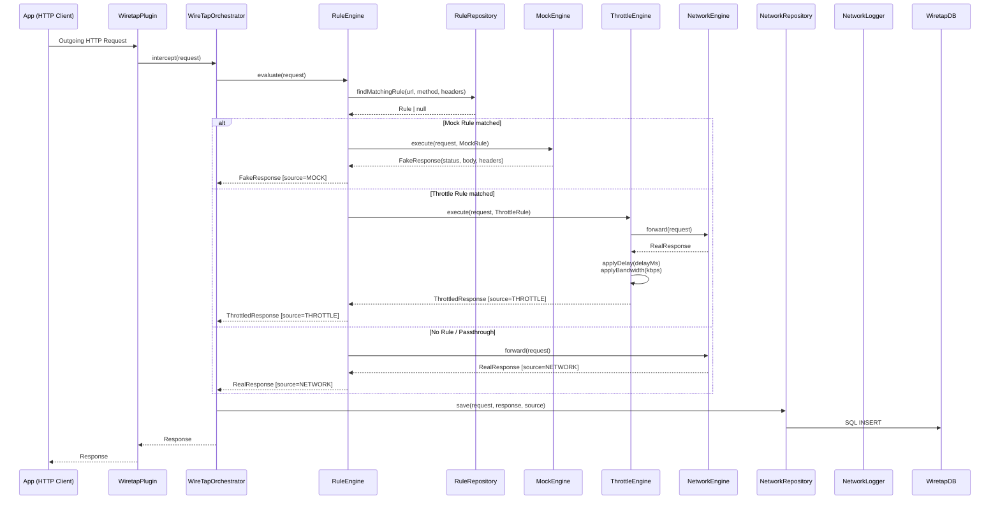

```mermaid
sequenceDiagram
    participant App as App (HTTP Client)
    participant Plugin as WiretapPlugin
    participant Orchestrator as WireTapOrchestrator
    participant RuleEngine as RuleEngine
    participant RuleRepo as RuleRepository
    participant MockEngine as MockEngine
    participant ThrottleEngine as ThrottleEngine
    participant NetworkEngine as NetworkEngine
    participant NetworkRepo as NetworkRepository
    participant Logger as NetworkLogger
    participant DB as WiretapDB

    App->>Plugin: Outgoing HTTP Request
    Plugin->>Orchestrator: intercept(request)
    Orchestrator->>RuleEngine: evaluate(request)

    RuleEngine->>RuleRepo: findMatchingRule(url, method, headers)
    RuleRepo-->>RuleEngine: Rule | null

    alt Mock Rule matched
        RuleEngine->>MockEngine: execute(request, MockRule)
        MockEngine-->>RuleEngine: FakeResponse(status, body, headers)
        RuleEngine-->>Orchestrator: FakeResponse [source=MOCK]

    else Throttle Rule matched
        RuleEngine->>ThrottleEngine: execute(request, ThrottleRule)
        ThrottleEngine->>NetworkEngine: forward(request)
        NetworkEngine-->>ThrottleEngine: RealResponse
        ThrottleEngine->>ThrottleEngine: applyDelay(delayMs)<br/>applyBandwidth(kbps)
        ThrottleEngine-->>RuleEngine: ThrottledResponse [source=THROTTLE]
        RuleEngine-->>Orchestrator: ThrottledResponse [source=THROTTLE]

    else No Rule / Passthrough
        RuleEngine->>NetworkEngine: forward(request)
        NetworkEngine-->>RuleEngine: RealResponse [source=NETWORK]
        RuleEngine-->>Orchestrator: RealResponse [source=NETWORK]
    end

    Orchestrator->>NetworkRepo: save(request, response, source)
    NetworkRepo->>DB: SQL INSERT

    Orchestrator-->>Plugin: Response
    Plugin-->>App: Response
```