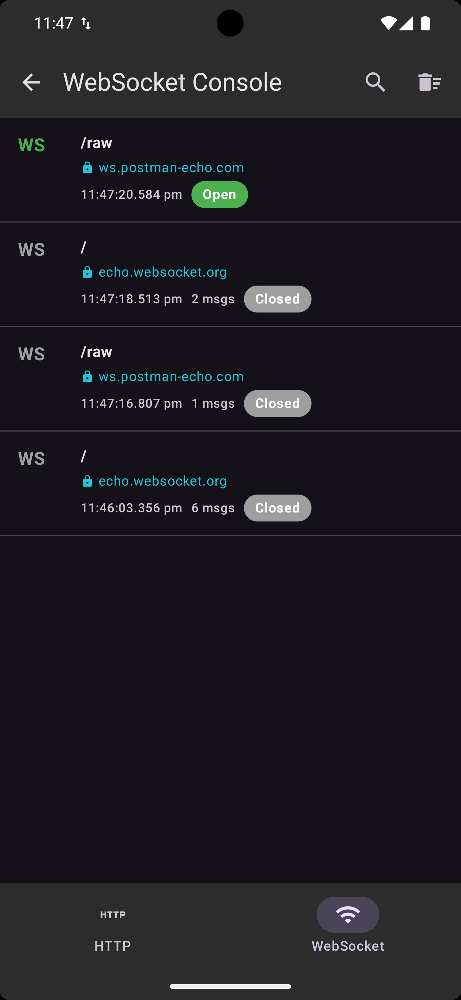
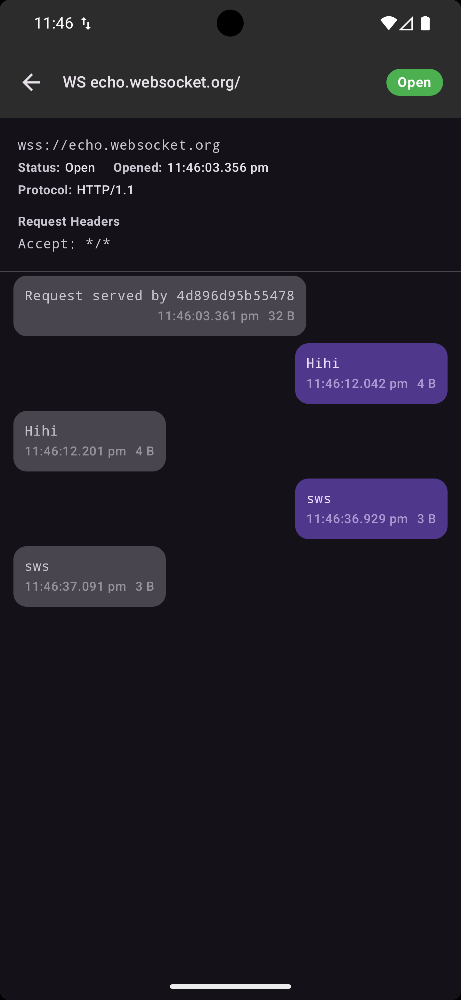

# OkHttp — WebSocket Logging

=== "Connections"

    { width="300" }

=== "Messages"

    { width="300" }

## Setup

Use the `wiretapped()` extension on any `WebSocketListener`:

```kotlin
val request = Request.Builder().url("wss://echo.websocket.org").build()
client.newWebSocket(request, myListener.wiretapped())
```

### Full example

```kotlin
val myListener = object : WebSocketListener() {
    override fun onOpen(webSocket: WebSocket, response: Response) {
        webSocket.send("Hello!")  // Automatically logged (outgoing)
    }

    override fun onMessage(webSocket: WebSocket, text: String) {
        println("Received: $text")  // Automatically logged (incoming)
    }

    override fun onClosing(webSocket: WebSocket, code: Int, reason: String) {
        webSocket.close(1000, null)
    }

    override fun onClosed(webSocket: WebSocket, code: Int, reason: String) {
        println("Closed: $code $reason")
    }

    override fun onFailure(webSocket: WebSocket, t: Throwable, response: Response?) {
        println("Failed: ${t.message}")
    }
}

val request = Request.Builder().url("wss://echo.websocket.org").build()
client.newWebSocket(request, myListener.wiretapped())
```

## How It Works

`WiretapOkHttpWebSocketListener` wraps all `WebSocketListener` callbacks:

| Callback | What's Logged |
|----------|--------------|
| `onOpen` | Connection opened (status: Open). WebSocket is wrapped for outgoing logging |
| `onMessage(text)` | Text message received |
| `onMessage(bytes)` | Binary message received (auto-decoded as text when it looks like UTF-8, otherwise `[Binary: N bytes]`) |
| `onClosing` | Status updated to Closing with close code/reason |
| `onClosed` | Status updated to Closed with timestamp |
| `onFailure` | Status updated to Failed with error message |

All events are delegated to your original listener after logging.

### Outgoing Message Logging

The `webSocket` parameter passed to your `onOpen()` callback is actually a `WiretapWebSocket` that intercepts `send()` calls:

```kotlin
override fun onOpen(webSocket: WebSocket, response: Response) {
    // webSocket is a WiretapWebSocket — send() calls are logged automatically
    webSocket.send("Hello!")        // Logged: Text, Sent, "Hello!"
    webSocket.send(byteString)      // Logged: Binary, Sent, auto-decoded text or "[Binary: N bytes]"
}
```

All other `WebSocket` methods (`close()`, `cancel()`, `request()`, `queueSize()`) pass through to the original.

## What Gets Logged

### Connection

- URL
- Request headers
- Protocol
- Status transitions (Open → Closing → Closed / Failed)
- Close code and reason
- Failure message

### Messages

- Direction (Sent / Received)
- Content type (Text / Binary)
- Content (text, decoded binary, or `[Binary: N bytes]`)
- Byte count
- Timestamp

## Configuration

Use the config DSL overload to configure WebSocket logging:

```kotlin
client.newWebSocket(request, myListener.wiretapped {
    enabled = BuildConfig.DEBUG

    // How to render Binary frames. Defaults to Auto.
    binaryDecoding = BinaryFrameDecoding.Auto
    // = BinaryFrameDecoding.Utf8         // always decode as UTF-8 (replacement chars on invalid bytes)
    // = BinaryFrameDecoding.Placeholder  // never decode, always show "[Binary: N bytes]"
    // = BinaryFrameDecoding.Custom { bytes -> bytes.toHexPreview() }
})
```

Or use the simple `enabled` parameter:

```kotlin
client.newWebSocket(request, myListener.wiretapped(enabled = false))
```

### `binaryDecoding`

`Auto` (default) tries strict UTF-8 — if the payload is valid printable text it's shown as text, otherwise it falls back to `[Binary: N bytes]`. This lets libraries that ship text-over-binary (e.g. SignalRKore) appear readable without misrepresenting genuine binary like protobuf or MessagePack.

`Custom` lets you supply your own renderer for non-UTF-8 charsets, hex previews, or pretty-printing.

## No-op

The noop module (`wiretap-okhttp-noop`) provides the same `wiretapped()` extensions but delegates all callbacks directly without logging.
